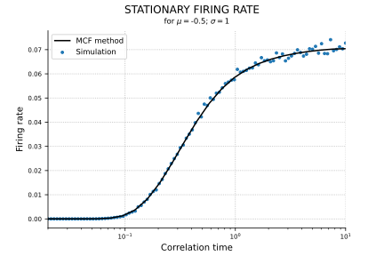

# Theta neuron and correlated noise

This repository provides code (including a PyTorch implementation for GPU acceleration) for the numerical matrix-continued fraction (MCF) method from the Paper. url....

In the following we briefly introduce the considered neuron model and the statistics of interests, i.e. the firing rate, which is computed by means of the MCF methods. For a detailed description of the MCF method please see the paper above.

<p align="center">

</p>

In this paper we have studied the so-called theta neuron, supject to a correlated noise and deterministic, periodic stimulus (see illustration above):

<p align="center">

</p>


| notation | parameter |
|------------|---------------|
|  |  phase|
|  | mean input |
|  |deterministic signal |
|  | noise: 1D Ornstein-Uhlenbeck process |
|  | correlation time |
|  |  standard deviation |
|  |  Gaussian white noise |


Whenever the phase crosses the threshold at  a delta spike is generated. Over time, the neuron produces the spike-train:

<p align="center">

</p>

Here, we are interested in the instantanous firing rate of this noisy theta neuron, which can be calculated by averaging over an ensemble of neurons:

<p align="center">

</p>

In the following we consider three different cases where the neuron is subject to a correlated noise and 1) no external stimulus, 2) a cosine stimulus or 3) two cosine stimuli. In particular, we always consider the case of , so that the the initial conditions can be neglected. All functions needed to compute the firing rate in this three cases are provided in `MCF.py`. For an explanation on how to deploy the MCF method see the following examples. 

In our paper, we validated the results gained with the MCF method with numerical simulations. To this end we used a simple Euler-Maruyama scheme of the DEQ above. The core implementation (in Python and PyTorch - allowing GPU acceleration) can be found in `simulation.py`. How this can be used to compute properties such as the stationary firing rate is shown in `example_simulation.py`.

## 1) Stationary firing rate

With no external time-dependend stimulus the firing rate of the neuron relaxes into a stationary state: 

<p align="center">
. 
</p>
  
This stationary firing rate can be computed using the MCF method. The implementation is giving by the function `stationary_firing_rate(tau,sigma,mu,n_max = 100,p_max = 100)`, e.g.:

```python
# for PyTorch version just swap MCF <-> MCF_torch
import MCF

stationary_rate = MCF.stationary_firing_rate(tau=1,sigma=1,mu=-.5)
```

An example of how this function can be used to compute the firing rate with respect to the correlation time  is giving in `example_stationary_firing.py`. As a reference the firing rate was also simulated by numerical integration of the stochastic differential equation. The output should look as follows:

<p align="center">

</p>

```diff
- Inserting an exemple on how well the MCF method works!!!
```

## 2) Cosine stimulus

If the model is driven by an additional periodic stimulus such as

<p align="center">

</p>

the firing rate relaxes into its *cyclo-stationary* state. We can express this cyclo-stationary firing rate in terms of a pertubation and Fourier series (truncated after order `l_max`):

<p align="center">

</p>

| notation | parameter |
|------------|---------------|
|  | amplitude|
|  | frequency |
|  | response functions |

  
The function `response_funcs_cosine_signal(tau,sigma,mu,omega,l_max = 5,n_max = 100,p_max = 100)` computes all response functions `r_l,k` up to the order `l_max`. These can then be used to compute the cyclo-stationary firing rate implemented in `response_cosine_signal(...)`:

```python
import MCF
from math import pi

tau = 0.2
sigma = 1
mu = 1

omega = 1
epsilon = 0.4

# compute response functions
response_func = MCF.response_funcs_cosine_signal(tau, sigma,mu,omega,l_max=5)

# compute the response for one period
response,t = MCF.response_cosine_signal(epsilon,omega,response_func,t_start=0,t_end = 2*pi/omega,t_res=500)
```

How many response functions (up to order `l_max`) must be taken into account for an accurate description of the firing rate strongly depends on the amplitude of the stimulus and the parameters of the neuron model. For instance, in case of a weak stimulus `l_max = 1`, which provides the linear response, might suffice. A more comprehensive discussion of this can be found in the paper. Note however, that the MCF method that computes these response functions is an recursive method (`l -> l+1`) so that large values of `l_max` can lead to long computation times.

The file `example_periodic_stimulus.py` provides exemplary code to calculate the cyclo-stationary firing rate for parameters where the linear response does not accurately describe the actual firing rate. The ouput looks as follows:

<p align="center">

</p>

## 3) Two cosine stimuli

The previous method can be extended to the case of two periodic stimuli:

<p align="center">

</p>

Again, we consider the response of the firing rate to those stimuli after a relaxation period such that the initial condition can be neglected. Similar to the previous section the firing rate can then be written in terms of a pertubation and Fourier series (here, up to the second-order in `epsilon_1` and `epsilon_2`):


<p align="center">

</p>


The *first* line corresponds to the cyclo-stationary firing rate up to the second order `l_max = 2`, if the neuron is subject to the first signal `s_1` alone. The *second* line then corresponds to the cyclo-stationary firing rate up to the second order `l_max = 2`, if the neuron is subject to the second signal `s_2` alone. The *last two* lines describes the effect of both signals entering the neuron simultanousely.

| notation | parameter |
|------------|---------------|
|  | amplitudes|
|  | frequencies |
|  | response functions for single cosine stimulus |
|  | new response function for mixed effects |

Note that in the paper we used a slightly different notation, where e.g.

<p align="center">

</p>

The response functions can be computed using the function `response_funcs_two_cosine_signals(tau,sigma,mu,omega_1,omega_2,n_max=100,p_max=100)`, which can be used to compute the response with `response_two_cosine_signals(...)`:

```python
import MCF
from math import pi

tau = 0.05
sigma = 1
mu = 1

omega_1 = 0.5
epsilon_1 = 0.3
omega_2 = 1.5
epsilon_2 = 0.1

# compute response functions
response_func = MCF.response_funcs_two_cosine_signals(tau,sigma,mu,omega_1,omega_2)

# compute the response for one period
response_to_sum,t = MCF.response_two_cosine_signals(
    epsilon_1,omega_1,
    epsilon_2,omega_2,
    response_func,
    t_start=0,t_end=2*pi/omega_1,t_res=500)
```

An example for this particular set of parameters is giving in `example_two_periodic_stimuli.py`. Here again we provided the firing rate obtained from stochastic simulations as a reference. In order to give an idea whether or not the third line in the latter equation is important to accurately describe the firing rate, we made a distinction between the response to the sum of both signals (that includes the last two lines) and the sum of the responses to each individual stimilus (excluding the third line):

<p align="center">

</p>
